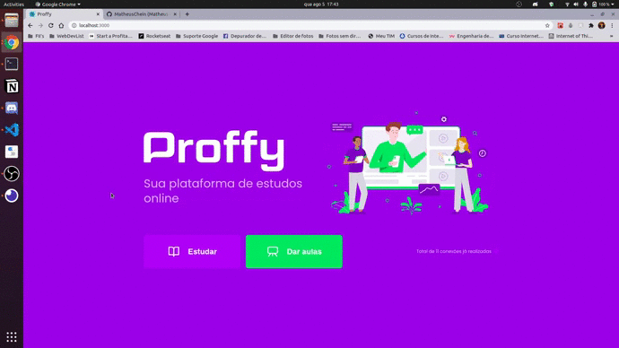

# Proffy

## :black_nib: About the app

Proffy is a platform to bring together students who want to learn high school subjects and teachers who can give those classes.


<h3 align="center"> :computer: Web app </h3>

<h1 align="center">
    
</h1>

<h3 align="center"> :iphone: Mobile app </h3>

<h1 align="center">
    
</h1>

## :rocket: Run the app

To run on your computer, you need:
  - **Node**
  - A package manager like **NPM** or **Yarn**
  - **Expo** to run the mobile app

1. Cloning the repo

```sh
  $ git clone https://github.com/MatheusChein/Proffy.git
```

2. Running the app:
  - Using npm

```sh
  # Install dependencies
  $ npm install

  ## Create the database
  $ cd server
  $ npm run knex:migrate

  # Start the server
  $ npm start

  # Start the web app
  $ cd web
  $ npm start

  # Start the mobile app
  $ cd mobile
  $ npm start
```
 - Using yarn

```sh
  # Install dependencies
  $ yarn

  ## Create the database
  $ cd server
  $ yarn knex:migrate

  # Start the server
  $ yarn start

  # Start the web app
  $ cd web
  $ yarn start

  # Start the mobile app
  $ cd mobile
  $ yarn start
```
## :toolbox: Technologies used

<ul>
<li>React</li>
<li>Typescript</li>
<li>Knex</li>
<li>SQLite3</li>
<li>Axios</li>
<li>ESLint</li>
<li>Prettier</li>
</ul>

## :man_technologist: Features

<ul>
<li>Componentization</li>
<li>React States</li>
<li>React Hooks</li>
<li>Custom React Component Properties</li>
<li>ES6+ Destructuring</li>
<li>Ternary Conditioning</li>
<li>Import / Export statements</li>
</ul>

## :memo: License

This project is under the MIT license. Check out the [LICENSE](LICENSE.md) file for further details.

## :briefcase: Contact me <br>

[](https://www.linkedin.com/in/matheus-chein/) 
[](mailto:matheuschein@gmail.com)
